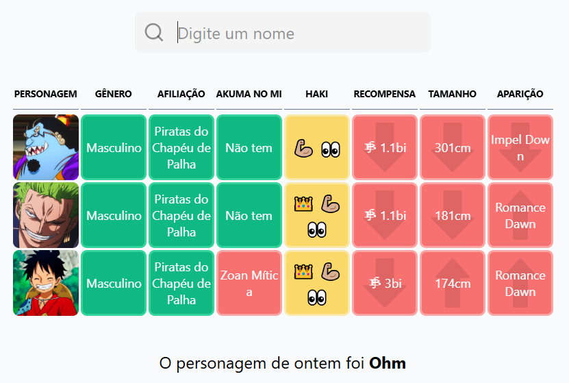

# 🏴‍☠️ Onepiecedle
OnePiecedle is a guessing game where players try to identify characters from the One Piece universe, inspired by the Wordle format. With each guess, hints are provided to help players figure out the correct character. Have fun testing your knowledge of the beloved series while challenging your friends!

> **_NOTE:_**  This project is a challenge created purely for learning and practice. It is heavily inspired by the existing OnePiecedle game. You can check it out [here](https://onepiecedle.net/).



## 🚀 Features
- Using TypeScript throughout the project
- Visual hints based on previous guesses.
- Interactive design with React and TailwindCSS.
- Data storage using MongoDB.

## 💫 Getting Started

Follow the instructions below to set up the project locally.

### Prerequisites

- Node.js
- npm or pnpm
- MongoDB

### Installation

1. Clone the repository:

    ```bash
    git clone https://github.com/kiteyz/onepiecedle.git
    cd onepiecedle
    ```

2. Install dependencies for both frontend and backend:

    ```bash
    cd backend
    pnpm install

    cd ../frontend
    pnpm install
    ```

3. Set up your MongoDB database and add the connection string to the .env file in the backend folder:

    ```bash
    MONGODB_URI=mongodb://your_url_to_onepiece_db
    ```

4. Run both frontend and backend:

    - Backend:
        ```bash
        cd backend
        pnpm run dev
        ```

    - Frontend:
        ```bash
        cd frontend
        pnpm run dev
        ```

## ℹ️ Informations

- Backend
    - **Framework:** Express
    - **Database:** MongoDB

- Frontend
    - **Framework:** React
    - **Styling:** TailwindCSS

## 🏆 Contributing

Contributions are welcome! Feel free to submit issues or pull requests.

1. Fork the project
2. Create a feature branch: git checkout -b feature-name
3. Commit your changes: git commit -m 'Add feature'
4. Push to the branch: git push origin feature-name
5. Open a pull request
